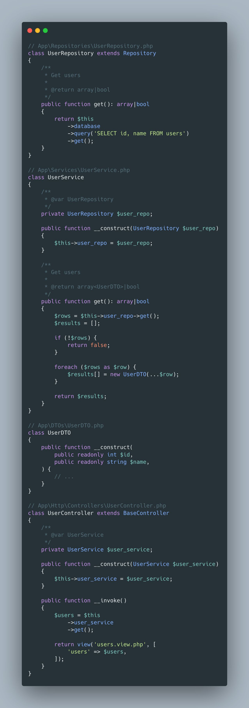

## Clean Architecture for PHP Applications!

Good architecture is crucial for applications of all sizes. Follow me as I explore how to create a multi-layered architecture for a PHP application that not only promotes code organisation but also enhances maintainability. Here’s a look at how we can structure our code for clarity and efficiency. The following example utilises the (in)famous Repository pattern to separate the Data layer and includes a Service layer for business logic, then a Controller layer for user input and presentation. You might notice that it is very similar to the MVC (Model-View-Controller ) pattern but with an added 'service' layer for business logic. Let's discuss the different layers:

- **The Repository Layer** (`UserRepository.php`): This is where all our data is handled. We query our database to fetch user details, acting as the sole gatekeeper for data access. This separation ensures our data logic stays neat and tidy.
- **The Service Layer** (`UserService.php`): It fetches the data via `UserRepository` and processes it, applying business logic to transform raw data into meaningful information. This layer bridges the gap between data and action, ensuring our business rules are encapsulated correctly.
- **Data Transfer Objects (DTOs)** (`UserDTO.php`): Carries our data. DTOs assist in transferring data across layers, ensuring a type-safe way of interacting with information. Each `UserDTO` carries user details to our application layers.
- **The Controller Layer** (`UserController.php`): This layer handles user requests, calls upon the necessary services to get the data, and presents it to the user. This layer is about retrieving and manipulating data to present to the user.

Together, these components form a symphony of clean code and architecture, making our application not just a pleasure to work with but also a robust platform ready to scale. 🌟

