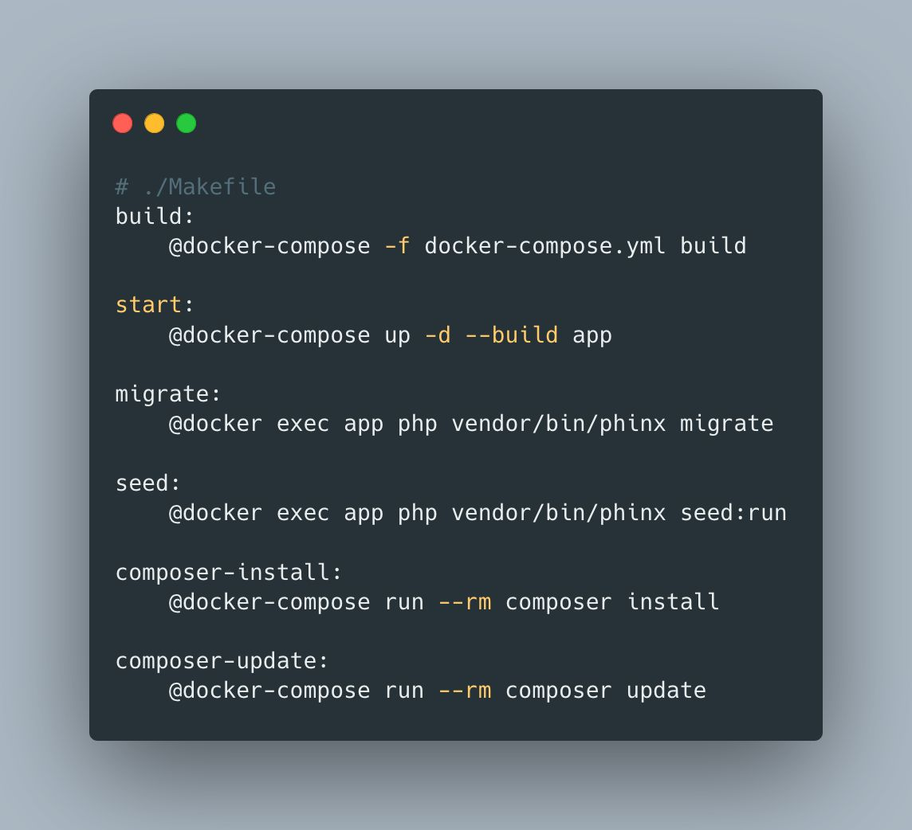

## Simplify your Build Process with Makefile

I love using Makefiles to simplify and organize the build logic of my projects.

Simplify the build process by eliminating manual commands and adopting standardized `make` commands such as `make build` and `make start` to build projects across different languages and frameworks.

Organize your build logic into neat, reusable sections. Makefiles can keep your build process clean and understandable, abstracting away the complex parts of your build process and allowing you to organize your logic in one place.

You can also integrate with other tools, enabling you to run steps either in sequence or concurrently to speed up builds.

May require some additional setup on Windows 😬

<!--  -->

```makefile
# ./Makefile
# Build our Docker image
.PHONY: build
build:
    @docker-compose -f docker-compose.yml build

# Start Docker Compose Containers
.PHONY: start
start:
    @docker-compose up -d --build app

# Run app container run database migrations
.PHONY: migrate
migrate:
    @docker exec app php vendor/bin/phinx migrate

# Run app container seed database
.PHONY: seed
seed:
    @docker exec app php vendor/bin/phinx seed:run

# Run composer container and run install
.PHONY: composer-install
composer-install:
    @docker-compose run --rm composer install

# Run composer container and run update
.PHONY: composer-update
composer-update
    @docker-compose run --rm composer update
```
