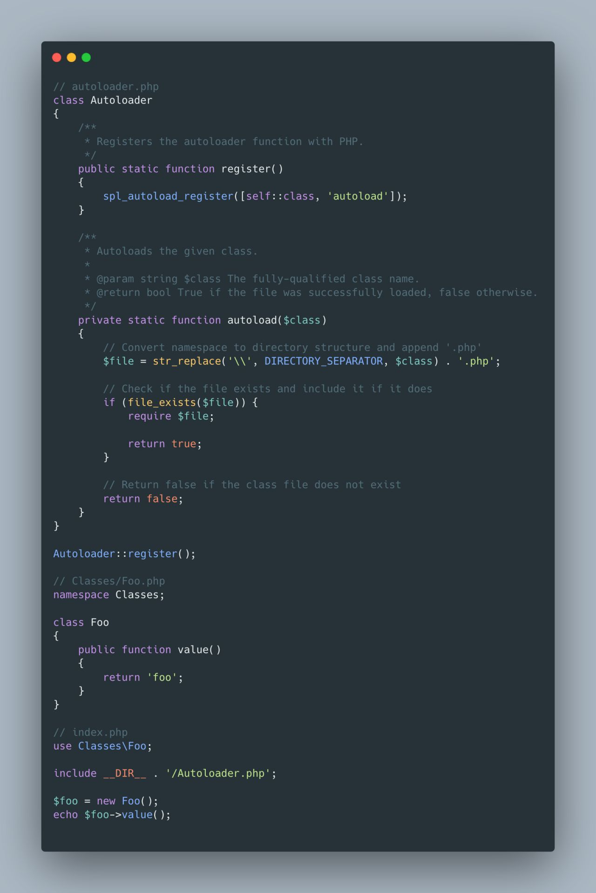

## PSR4 - Autoloader

Autoloading is a commonly used mechanism that automatically loads classes and/or files into memory when they are needed, without having to explicitly include them within each file. In the context of PHP, Composer uses this technique instead of typically using `require` or `include` statements to manually load each class before the class is used. Composer can generate a list of mappings defined in `composer.json` and autoload third party dependencies without much requirement from the user.

Outside of Composer, it is possible to write your own autoloader function so that PHP automatically calls classes that haven't been loaded yet. The `spl_autoload_register()` function allows you to register one or more autoloaders.

Some of the benefits of autoloading are:
- Simplicity
- Efficiency
- Maintainability

Although writing your own autoloader can be fun and is a great learning experience, it is always better to use tried and tested methods such as Composer's autoloader when building applications that may go into production.

<!--  -->

```php
// autoloader.php
class Autoloader
{
    /**
     * Registers the autoloader function with PHP.
     */
    public static function register()
    {
        spl_autoload_register([self::class, 'autoload']);
    }

    /**
     * Autoloads the given class.
     *
     * @param string $class The fully-qualified class name.
     * @return bool True if the file was successfully loaded, false otherwise.
     */
    private static function autoload($class)
    {
        // Convert namespace to directory structure and append '.php'
        $file = str_replace('\\', DIRECTORY_SEPARATOR, $class) . '.php';

        // Check if the file exists and include it if it does
        if (file_exists($file)) {
            require $file;

            return true;
        }

        // Return false if the class file does not exist
        return false;
    }
}

Autoloader::register();

// Classes/Foo.php
namespace Classes;

class Foo
{
    public function value()
    {
        return 'foo';
    }
}

// index.php
use Classes\Foo;

include __DIR__ . '/Autoloader.php';

$foo = new Foo();
echo $foo->value();
```

Resources:
- https://www.php-fig.org/psr/psr-4/
- https://github.com/php-fig/fig-standards/blob/master/accepted/PSR-4-autoloader-examples.md
