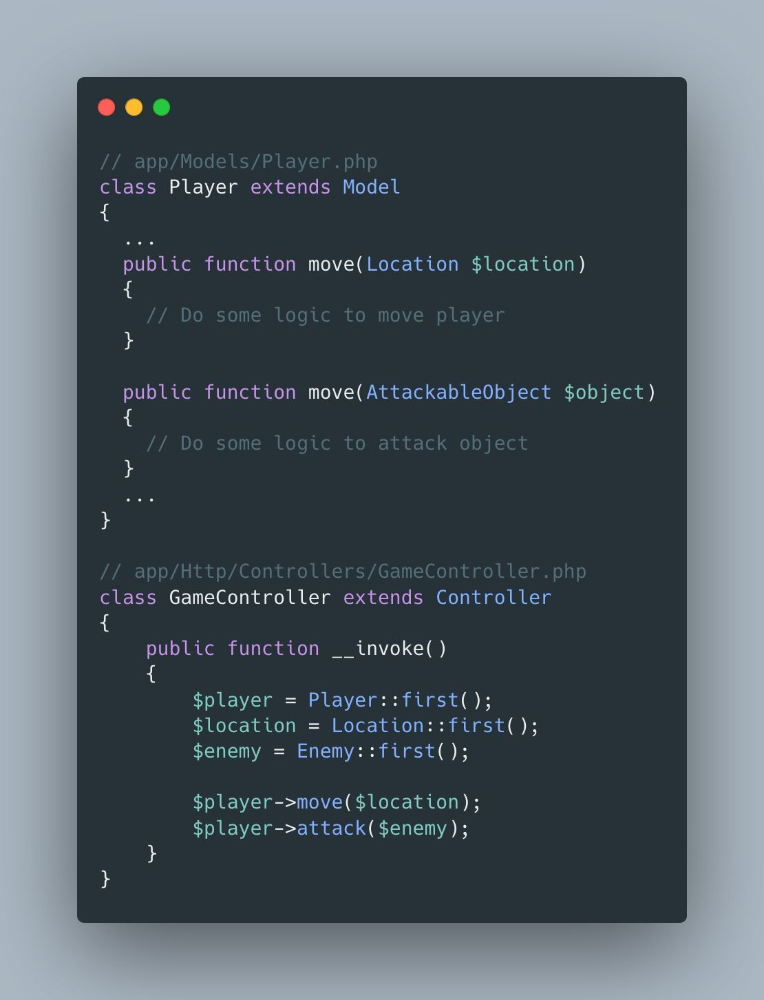

## Skinny Controllers, Fat Models

"Skinny Controllers, Fat Models" is a software design guideline commonly associated with the MVC (Model-View-Controller) architectural pattern. It suggests that the application's business logic should be placed in the model layer rather than in the controller. The idea is that the controller should remain lightweight, focusing primarily on handling user input, managing views, and returning a response.

This approach promotes various good practices, such as separation of concerns, reusability, simplified testing, loose coupling, and improved code organisation and readability.

This approach is commonly found in frameworks that use the Active Record pattern, such as Laravel, because models themselves are responsible for persistence as well as business logic, but this same reasoning could be applied to another layer, such as service-layer, command-layer, domain-layer, etc.

<!--  -->

```php
// app\Models\Player.php
class Player extends Model
{
    ...
    public function move(Location $location)
    {
        // Do some logic to move player
    }

    public function move(AttackableObject $object)
    {
        // Do some logic to attack object
    }
    ...
}

// app\Http\Controllers\GameController.php
class GameController extends Controller
{
    public function __invoke()
    {
        $player = Player::first();
        $location == Location::first();
        $enemy = Enemy::first();

        $player->move($location);
        $player->attack($enemy);
    }
}
```
